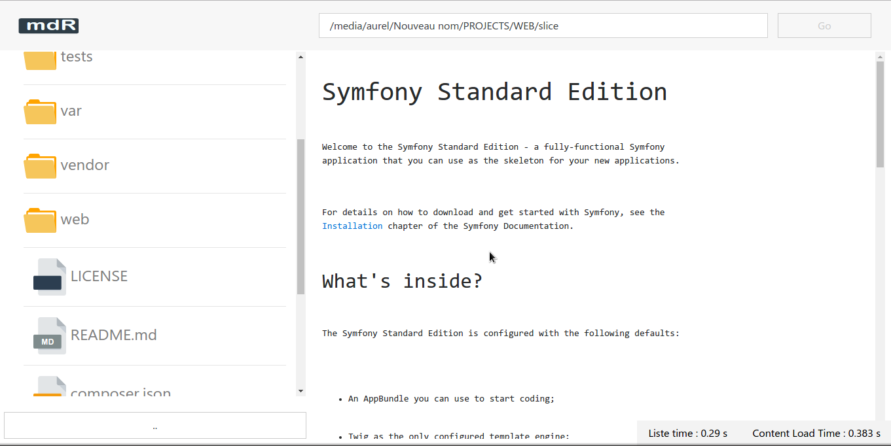

# mdR 

mdR is a file explorer write with angularjs and php. 
It also allow to preview files with entensions like md ,html, js,css, sass

This project has been inspired from [exploweb by Quetin77](https://github.com/quenti77/exploweb)

### Usage

Download this [mdR.zip](./../mdR.zip) and extract it somewhere

```shell
$ cd mdR

$ sh RUN.sh
```

Browse the [localhost:3000](http://localhost:3000) in your web browser.

### Screenshot

